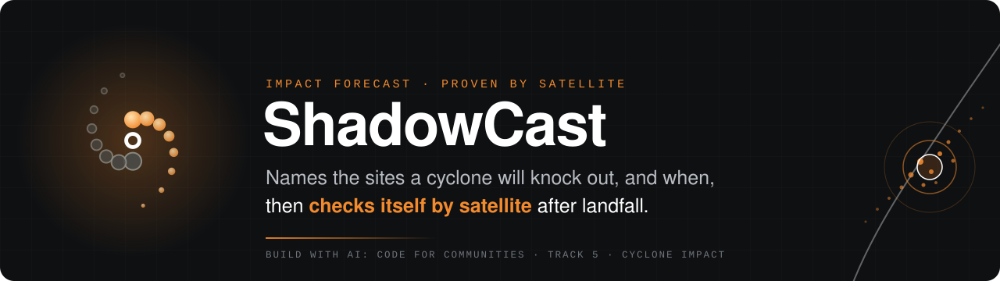
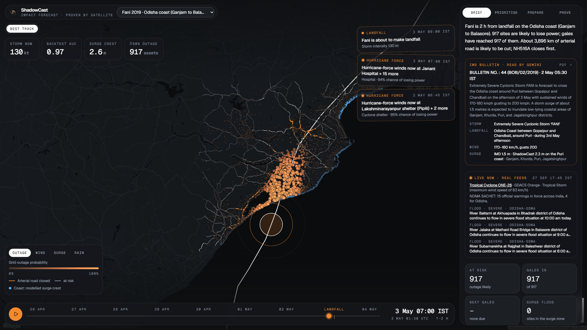
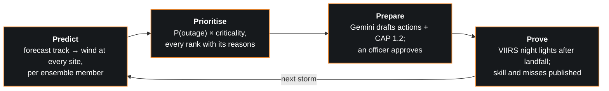
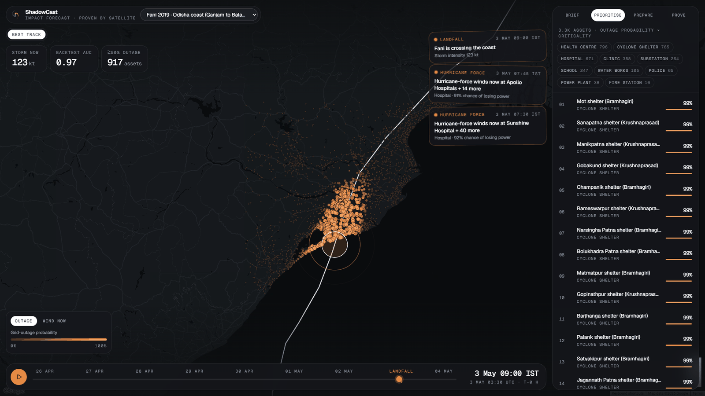
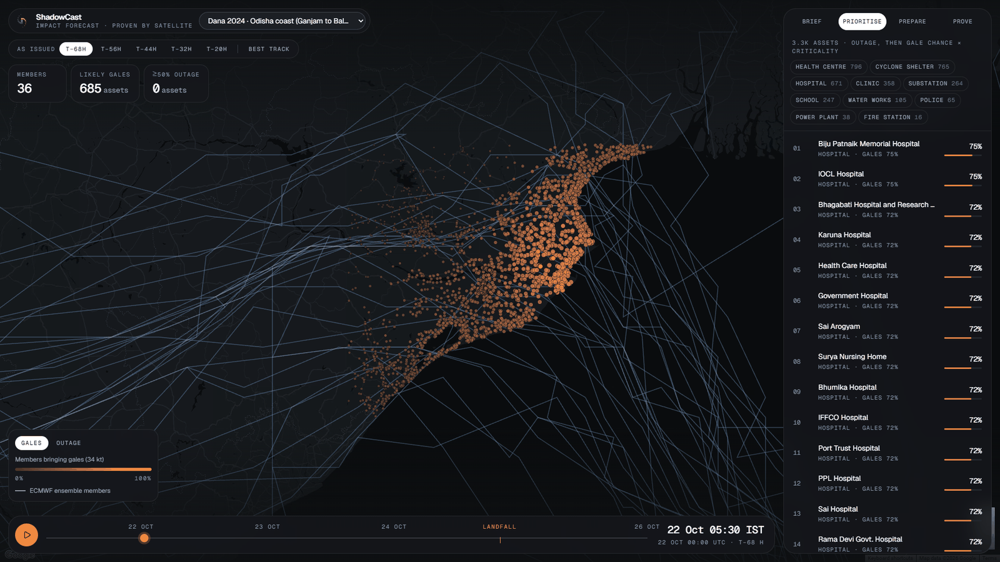
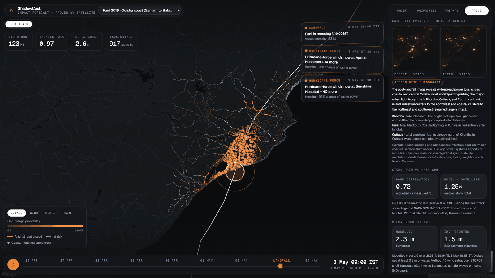
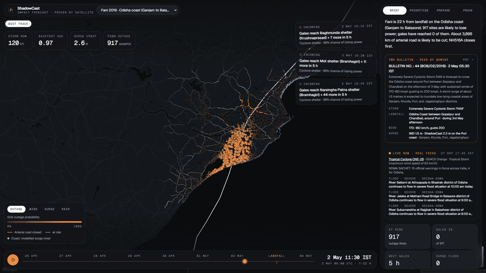
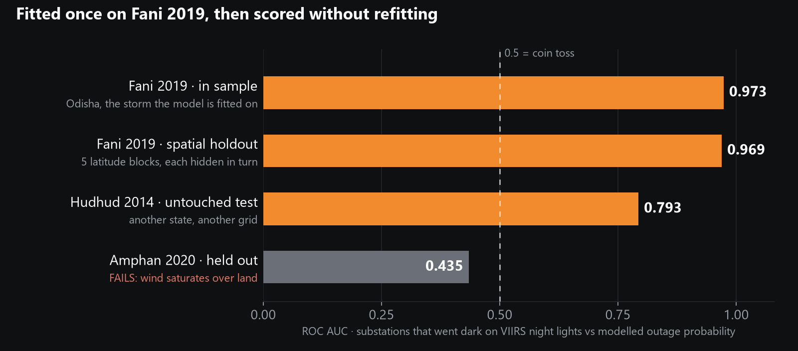
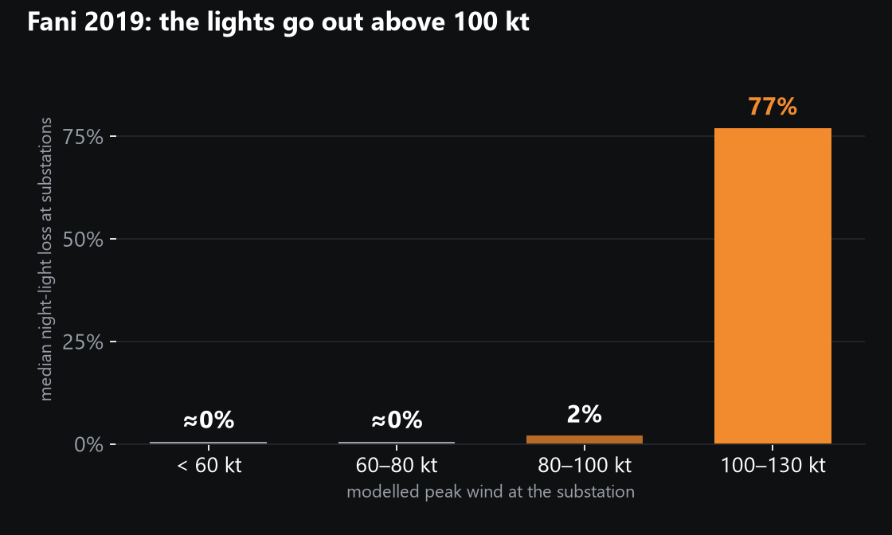
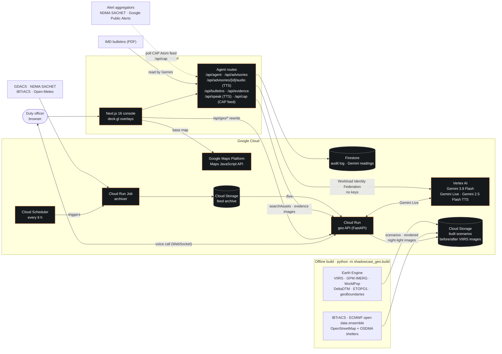

<div align="center">
  <p>
    <a href="https://shadowcast-two.vercel.app">
      </a>
  </p>

<div>
  <a href="https://shadowcast-two.vercel.app"></a>
  <a href="https://github.com/tsathya98/shadowcast/actions/workflows/web.yml"></a>
  <a href="https://github.com/tsathya98/shadowcast/actions/workflows/geo.yml"></a>
  <a href="https://github.com/tsathya98/shadowcast/actions/workflows/archiver.yml"></a>
  <a href="LICENSE"></a>
  <br>
  
  
  
  
  
  
</div>

<br>

**Impact-based cyclone forecasting for India's coast.** ShadowCast names the hospitals, shelters and substations likely to lose power, and when, up to 68 hours before landfall. After the storm it checks itself against NASA night-light satellites and publishes its misses.

[**Live demo**](https://shadowcast-two.vercel.app) · [Architecture](#architecture) · [Validation](#validation) · [Run locally](#run-locally) · [geo API docs](https://shadowcast-geo-489356738785.asia-south1.run.app/docs)

<sub>Built for <b>Build with AI: Code for Communities, Second Edition</b> · Track 5, <i>Track-Based Cyclone Impact &amp; Infrastructure Vulnerability Forecaster</i></sub>

<br>

<a href="https://shadowcast-two.vercel.app"></a>

<sub>Cyclone Fani (2019), 2 h before landfall. Amber roads have become unsafe; the blue band is the modelled surge crest. The Brief shows IMD's own bulletin as Gemini read it from the PDF, today's live NDMA warnings for Odisha, and what each agency must do before its deadline.</sub>

</div>

## What it does

A forecast gives a cyclone's track and strength. A district collector has to decide which hospital will lose power, which shelter will get hurricane-force wind, and how long there is to act. ShadowCast turns the track into that list for every named site on the coast, in four steps:



| Step | What happens |
|---|---|
| **Predict** | The track (IBTrACS best track, or each ECMWF ensemble forecast *as issued*) drives a Holland (1980) parametric wind field at every site, densified to 15-minute steps, R-CLIPER storm rain, a storm-surge model along the coast, and the same hazard along every arterial road |
| **Prioritise** | Sites are ranked by calibrated outage probability × criticality (hospitals and shelters 5, substations 4, …, schools 2). Every rank carries plain-language reasons |
| **Prepare** | Gemini drafts officer actions and a public CAP 1.2 advisory in English, Hindi and the region's language. Nothing is issued until an officer approves it. An approved advisory goes straight onto a public CAP feed, and every decision is audited |
| **Prove** | NASA VIIRS night-light loss is measured around every lit substation after landfall, and Gemini reads the before/after satellite images. Rain is scored against NASA GPM and surge against IMD. Skill and failures are published per storm |

The console opens on the **Brief** tab, which has:

- a live card with the cyclones GDACS is tracking and the NDMA SACHET warnings in force for the region's state today;
- IMD's own bulletin, as Gemini read it from the PDF;
- the situation in two sentences, and tiles for sites at risk, how many gales have reached and the next site in line;
- an action for each agency (health, power utility, district administration, water supply, police and fire), due before gales reach its first site, plus an evacuation action for sites the surge would flood and a public-works action for the arterial roads that will be cut;
- anticipatory finance: an illustrative parametric cover per district, with its trigger time, or its odds of paying out under a forecast;
- the latest officer decisions from the audit log.

ShadowCast's code computes these numbers from the ranked sites (Gemini sets none of them), and they update as you scrub the timeline.

<table>
  <tr>
    <td width="50%"></td>
    <td width="50%"></td>
  </tr>
  <tr>
    <td align="center"><b>Prioritise</b> · Fani at landfall. Every site ranked, with outage probability, gale arrival, surge, rain, access road and reasons; cut roads in amber</td>
    <td align="center"><b>As issued, T−68 h</b> · Dana 2024. 36 ECMWF members on the storm; 685 sites where at least half bring gales</td>
  </tr>
  <tr>
    <td width="50%"></td>
    <td width="50%"></td>
  </tr>
  <tr>
    <td align="center"><b>Prove</b> · Fani. Gemini reads the before/after satellite images; rain is scored against NASA GPM and surge against IMD</td>
    <td align="center"><b>Replay</b> · Fani, 2 May 06:00 → 3 May 06:00 UTC. Alerts fire as gales, then hurricane-force winds, reach named sites; roads turn amber as they close</td>
  </tr>
</table>

## What is new

Impact-based forecasting is not new, and ShadowCast stands on work like [CLIMADA](https://github.com/CLIMADA-project/climada_python) (ETH Zürich), the [510 / Netherlands Red Cross](https://www.510.global/) impact-based forecasting models and NDMA's Web-DCRA cyclone risk atlas. Three things are different here:

1. **An outage model learned from real outages.** Where other models use damage surveys or assumed fragility curves, ShadowCast's truth is NASA VIIRS night-light loss (VNP46A2) around 200 lit substations during Cyclone Fani. A logistic model on modelled peak wind fits those outages and crosses 50 % outage probability at about 107 kt.
2. **Forecasts as they were issued.** ShadowCast replays ECMWF's ensemble tracks from each issue time and runs every member through the same wind and outage model, giving per-site odds of gales, hurricane-force wind and power loss from 68 h to 20 h before landfall (Cyclone Dana 2024: 36 to 52 members on the storm per run).
3. **It checks itself after every storm, and publishes the misses.** The same satellite truth scores each storm once, with the Fani-fitted model and no refitting. Amphan 2020 fails, and the README and console say so.

## Validation

The outage model is fitted once, on Fani (2019), then scored without refitting. Truth is VIIRS night-light loss around each lit substation: a substation "lost power" when its light fell by at least 50 %.

<p align="center">
  
</p>

| Storm | Test | ROC AUC | Brier | What it shows |
|---|---|---|---|---|
| Fani 2019, Odisha | In sample | **0.973** | 0.049 | Above 100 kt substations lost a median 77 % of their lights; at or below 80 kt, about 0 % |
| Fani 2019, Odisha | Spatial holdout: 5 latitude blocks, each hidden in turn | **0.969** | 0.050 | Within held-out stretches that had outages: 0.85 to 0.94, so the fit does not depend on one stretch of coast |
| Hudhud 2014, North Andhra | Untouched test storm, another state and grid | **0.79** | 0.19 | Transfers to a direct strong hit on Visakhapatnam (Spearman 0.56) |
| Amphan 2020, West Bengal | Held out | 0.44 | 0.28 | Fails: modelled wind saturates over land, and the rural grid failed widely regardless of local wind |
| Dana 2024, Odisha | Held out, weak storm | (0.32) | 0.02 | Only 5 of 252 substations went dark, so AUC is meaningless; there were no false alarms |

<p align="center">
  
</p>

### Storm rain vs NASA GPM

Rain is the R-CLIPER parametric rain profile (Tuleya et al. 2007) accumulated along the track every 15 minutes, for the best track and for every ensemble member (giving the odds of 204.5 mm or more, IMD's "extremely heavy" threshold). It is scored at every site against NASA GPM IMERG V07 storm totals:

| Storm | Rank correlation with GPM | Model ÷ satellite (median) |
|---|---|---|
| Fani 2019 | 0.72 | 1.25 |
| Hudhud 2014 | 0.85 | 1.05 |
| Dana 2024 | 0.96 | 1.09 |
| Amphan 2020 | 0.14 | 1.36 |

Amphan is again the hard case: its rain fell far from where a symmetric, track-following model puts it.

### Parametric cover and basis risk

An illustrative district trigger (index = wind reached at a quarter of the district's sites; pays 25, 50 or 100 % at 64, 83 or 96 kt) turns the same hazard into anticipatory finance. On the best track ShadowCast reports when each district triggered and checks it against the satellites: in Fani, districts that triggered lost power at 18 % of their lit substations and districts that did not, at 0 %. Under an as-issued ensemble forecast it gives each district's probability of a payout days before landfall, the basis of forecast-based financing.

### Arterial roads and access

Every OpenStreetMap motorway, trunk and primary road in a region is sampled every kilometre and run through the same wind, surge and rain as the sites. Following IMD's damage classes, a road is **cut** where the surge floods it or winds reach 90 kt (an extremely severe cyclonic storm: "disruption of rail/road link at several places"), and **at risk** from 64 kt or under extreme rain on low ground. Travel on it becomes unsafe when it first enters the 64-kt radius. Each shelter and hospital is linked to its nearest arterial road, so it shows the deadline for moving people or supplies along it. On the map, cut roads turn amber as the replay passes their closing time. There is no turn-by-turn routing: a cut arterial road means the site must be reached, or left, before it closes.

### Storm surge vs IMD

Surge comes from a physics screening model. Along a coast-normal transect from every open-coast cell of ETOPO1 bathymetry out to the shelf edge, the steady 1D wind-setup equation is integrated shoreward using the onshore stress of the Holland wind field (Garratt drag, capped for hurricane winds), plus the inverse-barometer rise from the Holland pressure profile. The crest is carried inland at 1 m per 14.5 km and compared with **bare-earth DeltaDTM** ground (rooftop-height surface models make every hospital look high and dry). Each storm is compared once with what IMD reported:

| Storm | Where IMD reported it | IMD | ShadowCast (max on that coast) |
|---|---|---|---|
| Fani 2019 | Puri coast (IMD estimate at landfall) | 1.5 m | 2.3 m |
| Hudhud 2014 | Visakhapatnam port (**tide gauge**) | 1.4 m | 1.7 m |
| Amphan 2020 | South and North 24 Parganas (post-storm survey) | 4.6 m | 3.8 m |
| Dana 2024 | Kendrapara, Bhadrak and Balasore (IMD estimate) | 1 to 2 m | 2.8 m |

It gets the order of magnitude and the ranking of storms right (Amphan's wide, shallow shelf gives by far the highest surge) and runs high on narrow shelves, as 1D setup models do. There is no astronomical tide, wave setup or river flow.

We tried adding inland decay (Kaplan & DeMaria 1995) and terrain roughness (ESA WorldCover) to the wind model. It made the Fani spatial holdout worse (0.87), so we reverted it; the commit history has both versions. Amphan stays published as a miss, because the Prove step is there to catch that kind of failure before anyone relies on the model in a new grid.

<details>
<summary><b>As-issued ensemble replay: Cyclone Dana 2024</b></summary>
<br>

ECMWF's IFS ensemble tropical-cyclone track file for each issue time comes from ECMWF open data on Google Cloud (`gs://ecmwf-open-data`, history from 2024) and is decoded with ecCodes. The storm is picked from the worldwide file by member agreement, each member's hazard runs through the same wind model (radius of maximum wind from Willoughby, Darling & Rahn 2006), and results are aggregated per site: mean `P(outage)`, `p34` and `p64` (share of members bringing gale-force and hurricane-force wind), the 10/50/90 % peak wind and the median gale arrival.

| Issued | Lead to landfall | Members on Dana | Sites where ≥ half the members bring gales |
|---|---|---|---|
| 22 Oct 00Z | 68 h | 36 | 685 |
| 22 Oct 12Z | 56 h | 51 | 216 |
| 23 Oct 00Z | 44 h | 52 | 1,895 |
| 23 Oct 12Z | 32 h | 52 | 1,979 |
| 24 Oct 00Z | 20 h | 52 | 1,925 |

At 44 h the top priorities are Mahakalapada shelters and Paradip hospitals: 94 to 96 % of members bring gales, arriving around 24 Oct 05:00 UTC, about 15 h before landfall. No member brings hurricane-force wind, so outage probabilities stay near zero, which matches the observed lack of widespread blackouts. Ensemble peak winds are biased low (about 43 kt median vs Dana's 65 kt), a known limitation of global-model tracker winds; gale probability and arrival time are the more reliable outputs.

</details>

<details>
<summary><b>Assumptions and limitations</b></summary>
<br>

- Holland B = 1.5, no over-land decay and no asymmetry from forward motion, so peak winds over land are upper bounds.
- The outage model has one feature (wind). Grid topology, pole age and pre-emptive shutdowns are not modelled. It was calibrated on one storm in one state.
- Night-light loss is a proxy for grid outage. Clouds, the moon and festivals add noise, handled by medians, the quality mask and the 50 % threshold.
- Ensemble intensity is biased low and is not corrected.
- Storm surge is a screening model (see above) reported per site as water depth; it does not change the outage score.

Full method: [`services/geo/README.md`](services/geo/README.md).

</details>

## Gemini as the duty analyst

The **Prepare** tab is an agent on **Gemini 3.8 Flash on Vertex AI** (AI SDK `ToolLoopAgent`) that answers questions such as *"why is this hospital ranked #3?"*

| | |
|---|---|
| **Tools** | `searchAssets` queries the geo API, scoped to the replay being viewed. `officialBulletin` returns IMD's bulletin for the storm. `issueAdvisory` drafts officer actions per site plus a public CAP 1.2 message in English, Hindi and the region's language (Odia, Telugu or Bengali), validated against a schema |
| **Reads IMD's PDFs** | Gemini reads each storm's last archived pre-landfall IMD national bulletin straight from the PDF into a validated schema (position, wind, landfall, surge and districts, rainfall, expected damage, IMD's actions), cached in Firestore. The Brief shows it next to ShadowCast's numbers, and the analyst keeps advisories consistent with it, since IMD is the authority |
| **Live voice calls** | The officer can call the analyst and talk: a real-time call over **Gemini Live** (`gemini-live-2.5-flash-native-audio` on Vertex AI) in Hindi, Odia, Telugu, Bengali, Tamil or English. The analyst answers aloud as it thinks, can be interrupted mid-sentence, and both sides are captioned. The geo service bridges the call and answers the analyst's `search_assets` lookups from the scenario in memory, so every number it speaks comes from ShadowCast's model. Calls are limited to the console's origins, four per instance and four minutes each |
| **Hears and sees** | In the chat the officer can also send a voice note in any language (recorded in the browser, re-encoded as 16 kHz WAV and heard by Gemini directly, no separate speech-to-text), or attach a field photo, a PDF or an audio clip. A picker sets the language Gemini replies in |
| **Reads the satellites** | Gemini compares the region's VIIRS night lights before and after the storm (rendered by Earth Engine on one scale) and reports where the lights went out, how badly, what stayed lit and whether that agrees with ShadowCast's forecast. For Fani: Khordha, Puri and Cuttack totally dark, which agrees |
| **Human in the loop** | `issueAdvisory` needs an officer's approval on a card. Approvals are HMAC-signed so they cannot be forged; rejections are recorded too |
| **Dispatch** | Approving an advisory publishes it on a public CAP 1.2 Atom feed, [`/api/cap`](https://shadowcast-two.vercel.app/api/cap). That is the form alert aggregators such as NDMA SACHET and Google Public Alerts poll, so no one has to send it by hand. Messages stay marked `Exercise` |
| **Audit** | Every decision is written once to an append-only Firestore audit log |
| **Voice** | Gemini 2.5 Flash TTS reads approved advisories, and any chat reply, aloud in each language (classic Cloud Text-to-Speech has no Odia voice) |
| **Guardrails** | Gemini never sets a probability: every number it quotes comes from ShadowCast's deterministic model through the geo API. In forecast replays it never sees the outcome |

ShadowCast produces draft advisories for authorised officials. IMD and NDMA remain the authoritative sources for warnings.

## Architecture



- **Console** ([`apps/web`](apps/web)): Next.js 16 (App Router), React 19, Tailwind 4 on Vercel. Data is fetched client-side with SWR through the same-origin `/api/geo/*` rewrite, so the API location is server configuration only.
- **Keyless access:** Vercel's OIDC token is exchanged through Workload Identity Federation for short-lived credentials of a service account that may only call Vertex AI and use Firestore. There is no service-account key anywhere.
- **geo API** ([`services/geo`](services/geo)): FastAPI on Cloud Run. It serves the built scenarios and computes wind at every site at any moment for the timeline scrubber. It also serves the before/after VIIRS images that Earth Engine rendered at build time, which `/api/evidence` hands to Gemini to read, and bridges live voice calls to Gemini Live over a WebSocket (`/scenarios/{id}/voice`).
- **Storage:** all on Google Cloud, with built scenarios and the feed archive in Cloud Storage, the audit log and bulletin readings in Firestore (free tier). Nothing is kept on local disk or in the browser.
- **Archiver** ([`services/archiver`](services/archiver)): a Cloud Run Job that snapshots the feeds with no public history (GDACS, NDMA SACHET CAP alerts, IBTrACS provisional, WeatherNext 2 via Open-Meteo) every 6 h, triggered by Cloud Scheduler, so any storm, including one forming during judging, can be replayed later as issued.

## Coverage

Three coasts and four storms, with every site named and no synthetic data.

| Region | Storms | Sites | Advisory languages |
|---|---|---|---|
| Odisha coast (Ganjam to Balasore) | Fani 2019 (reference), Dana 2024 (as-issued ensemble) | 3,325 | English · Hindi · Odia |
| North Andhra coast | Hudhud 2014 (untouched test) | 1,729 | English · Hindi · Telugu |
| West Bengal coast | Amphan 2020 (held out) | 2,227 | English · Hindi · Bengali |

On the Odisha coast the 3,325 sites are 765 official OSDMA cyclone shelters plus 2,560 from OpenStreetMap: 264 substations, 38 power plants, 671 hospitals, 796 health centres, 358 clinics, 247 schools, 105 water works, 65 police and 16 fire stations. Each carries WorldPop population within 2 km, ground elevation and its modelled surge water.

<details>
<summary><b>Data sources and licences</b></summary>
<br>

| Source | Used for | Licence / terms |
|---|---|---|
| [IBTrACS](https://www.ncei.noaa.gov/products/international-best-track-archive) (NOAA NCEI) | Best tracks: intensity, radius of maximum wind, wind radii | NOAA open data |
| [ECMWF open data](https://www.ecmwf.int/en/forecasts/datasets/open-data) (`gs://ecmwf-open-data`) | As-issued IFS ensemble tropical-cyclone tracks | CC BY 4.0 |
| [OpenStreetMap](https://www.openstreetmap.org/copyright) contributors | Hospitals, substations, schools, water works, police and fire stations | ODbL |
| OSDMA cyclone shelter registry | 765 official cyclone shelters in Odisha | Published by OSDMA |
| [WorldPop](https://www.worldpop.org/) (`WorldPop/GP/100m/pop`) | Population within 2 km of each site | CC BY 4.0 |
| [DeltaDTM](https://doi.org/10.1038/s41597-024-03091-9) (Pronk et al. 2024) | Bare-earth coastal ground elevation, for surge flooding | CC BY 4.0 |
| [Copernicus DEM GLO-30](https://spacedata.copernicus.eu/collections/copernicus-digital-elevation-model) | Elevation inland, beyond DeltaDTM | Copernicus DEM licence |
| [ETOPO1](https://www.ncei.noaa.gov/products/etopo-global-relief-model) (NOAA) | Shelf bathymetry for the surge transects | NOAA open data |
| [NASA GPM IMERG V07](https://gpm.nasa.gov/data/imerg) | Satellite storm-total rainfall, the rain truth | NASA open data |
| [geoBoundaries](https://www.geoboundaries.org/) ADM2 | District boundaries for the parametric cover | CC BY 4.0 |
| [IMD / RSMC New Delhi](https://rsmcnewdelhi.imd.gov.in/) bulletins and reports | Official forecasts read by Gemini; observed surge for validation | IMD |
| [NASA VIIRS VNP46A2](https://ladsweb.modaps.eosdis.nasa.gov/missions-and-measurements/products/VNP46A2/) (Black Marble) | Night-light truth before vs after landfall | NASA open data |
| [GDACS](https://www.gdacs.org/) (EC JRC / UN OCHA) | Archived as-issued forecast cones | GDACS terms |
| [NDMA SACHET](https://sachet.ndma.gov.in/) | Archived official CAP 1.2 warnings | NDMA |
| [Open-Meteo](https://open-meteo.com/) (WeatherNext 2) | Archived ensemble point forecasts at district HQs | CC BY 4.0 |


</details>

## Engineering

- **Strict typing:** Pyright in strict mode on both Python services; TypeScript `strict` in the console.
- **Lint and format:** ruff (lint + format) for Python; ESLint and Prettier for the console.
- **Coverage:** 100 % line coverage on the geo service, the archiver and the console's shared logic (`src/lib`: brief, alerts, advisory and CAP builder, media, formatting), enforced by `pytest --cov-fail-under=90` and Vitest 90 % line and branch thresholds.
- **CI:** one GitHub Actions workflow per component ([web](.github/workflows/web.yml), [geo](.github/workflows/geo.yml), [archiver](.github/workflows/archiver.yml)): lint, format, type check, tests, then a container build or production build.
- **Security and cost:** keyless auth via Workload Identity Federation, least-privilege service accounts, approval signing, and a budget alarm on the Google Cloud project.
- **Deploy:** idempotent `gcloud` scripts in [`infra`](infra).

<details>
<summary><b>Repository layout</b></summary>
<br>

| Path | What |
|---|---|
| [`apps/web`](apps/web) | Operations console: Google Maps + deck.gl, timeline replay, ensemble spaghetti, Brief, ranked sites with reasons, the Gemini duty analyst, backtest. Next.js 16 on Vercel |
| [`services/geo`](services/geo) | Hazard per site, calibrated outage probability, ranking with reasons, satellite backtests, as-issued ensemble replay. FastAPI on Cloud Run |
| [`services/archiver`](services/archiver) | Cloud Run Job that snapshots GDACS, NDMA SACHET, IBTrACS and WeatherNext 2 (via Open-Meteo) every 6 h for as-issued replays |
| [`infra`](infra) | Idempotent `gcloud` deployment scripts: geo API, archiver, agent resources, Vercel federation |

</details>

<details>
<summary><b>Tech stack</b></summary>
<br>

| Layer | Technology |
|---|---|
| AI | Gemini 3.8 Flash on Vertex AI (duty analyst with tools; PDF, image and audio input; structured output), Gemini Live (real-time voice calls with tools), Gemini 2.5 Flash TTS |
| Geospatial | Google Earth Engine (VIIRS, GPM IMERG, WorldPop, DeltaDTM, Copernicus DEM, ETOPO1, geoBoundaries), ecCodes for ECMWF track files |
| Backend | Python 3.12, FastAPI, uv, Cloud Run service and Cloud Run Job, Cloud Storage |
| Frontend | Next.js 16 (App Router), React 19, Tailwind 4, Google Maps Platform + deck.gl, SWR |
| Data and audit | Firestore (append-only advisory audit log, bulletin readings), Cloud Storage (scenarios, archive) |
| Platform | Vercel, Google Cloud, Workload Identity Federation, GitHub Actions |

</details>

## Run locally

<details open>
<summary><b>Console</b> (<code>apps/web</code>)</summary>
<br>

```bash
cd apps/web
cp .env.example .env.local          # set NEXT_PUBLIC_GOOGLE_MAPS_API_KEY; GEO_API_URL defaults to the Cloud Run API
pnpm install
pnpm dev                            # http://localhost:3000
pnpm format:check && pnpm lint && pnpm typecheck && pnpm test && pnpm build
```

The agent and audio routes use Application Default Credentials (`gcloud auth application-default login`) for Vertex AI and Firestore in `GOOGLE_CLOUD_PROJECT`. Set `TOOL_APPROVAL_SECRET` so approvals are signed. The Maps key must be a browser key restricted to the Maps JavaScript API and to your origins.

</details>

<details>
<summary><b>geo service</b> (<code>services/geo</code>)</summary>
<br>

```bash
cd services/geo
uv sync --all-extras
uv run ruff check . && uv run ruff format --check . && uv run pyright && uv run pytest
uv run python -m shadowcast_geo.build                  # writes to gs://$GEO_BUCKET (gcloud ADC with Earth Engine)
uv run uvicorn shadowcast_geo.api:create_app --factory --reload   # serves from the same bucket
```

Point the console at it with `GEO_API_URL=http://localhost:8000`. Deploy with [`infra/geo.sh`](infra/geo.sh).

</details>

<details>
<summary><b>Feed archiver</b> (<code>services/archiver</code>)</summary>
<br>

```bash
cd services/archiver
uv sync
uv run ruff check . && uv run ruff format --check . && uv run pyright && uv run pytest
uv run python -m shadowcast_archiver          # writes to gs://$ARCHIVE_BUCKET
```

Deploy with [`infra/archiver.sh`](infra/archiver.sh).

</details>

## Roadmap

Next: turn-by-turn evacuation routing around cut roads · shelter capacity · per-utility outage models from real outage logs.

## Team and licence

**Team Argmax** (solo). Released under the [Apache-2.0](LICENSE) licence.

<div align="center">
  <sub>ShadowCast produces draft advisories for authorised officials. IMD and NDMA remain the authoritative sources for cyclone warnings.</sub>
</div>
